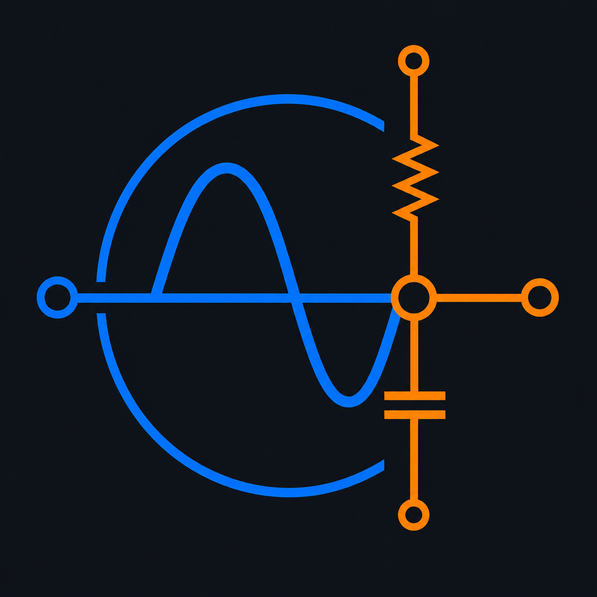

# Schemo

<p align="center">
  
</p>

**Schemo** is an AI-powered engineering visualization platform that gives Claude and ChatGPT the ability to generate professional control systems plots and electrical circuit schematics — directly inside the chat.

Students don't need to install Python, MATLAB, or any local tools. Everything runs in the cloud.

## Features

### 1. System Analysis (`schemo:plot`)
Built on the `python-control` library. Pass transfer function coefficients H(s) = num(s)/den(s) and get:
- **Bode Plots** - Magnitude and phase frequency response
- **Step Response** - Time-domain step input analysis
- **Impulse Response** - Time-domain impulse input analysis
- **Nyquist Plots** - Stability analysis in the complex plane
- **Root Locus** - Pole migration as gain varies

### 2. Circuit Schematics (`schemo:circuit`)
Give component types and 2D coordinates, and Schemo renders publication-quality circuit diagrams using `schemdraw`. Supports resistors, capacitors, inductors, diodes, voltage/current sources, ground, and wire connections.

### 3. Interactive Dashboard
Every plot comes with a deep link to an interactive Plotly dashboard (hosted on Cloudflare Pages) where students can zoom, pan, and inspect data points. Transfer functions render with proper LaTeX math via KaTeX.

## Architecture

Schemo is split into two cloud-hosted components with zero local dependencies for students:

```
┌─────────────────────┐       ┌──────────────────────────────────┐
│   Claude Desktop    │──SSE──│  Python Backend (Render)         │
│   or ChatGPT        │       │  api-schemo.shaniai.tech         │
└─────────────────────┘       │                                  │
                              │  FastAPI + FastMCP               │
                              │  ├─ /mcp/sse    (Claude SSE)     │
                              │  ├─ /api/plot   (ChatGPT REST)   │
                              │  ├─ /api/circuit(ChatGPT REST)   │
                              │  └─ /favicon.ico                 │
                              └──────────────────────────────────┘
                                            │
                                    generates dashboard URL
                                            │
                              ┌──────────────────────────────────┐
                              │  React Dashboard (Cloudflare)    │
                              │  schemo.shaniai.tech              │
                              │                                  │
                              │  Vite + React + Plotly + KaTeX   │
                              │  Client-side math (control.ts)   │
                              └──────────────────────────────────┘
```

### How It Works

1. **Student asks:** "Plot the step response for H(s) = 100/(s² + 10s + 100)"
2. **AI calls Schemo:** Sends numerator `[100]` and denominator `[1, 10, 100]` to the backend
3. **Backend computes:** Generates a matplotlib PNG + a dashboard URL with encoded parameters
4. **AI displays:** Shows the static PNG inline in chat + a bold link to the interactive dashboard
5. **Student explores:** Clicks the link → opens the React dashboard with interactive Plotly charts, KaTeX-rendered equations, and tab switching between all 5 plot types

## Installation

### For Students (Claude Desktop)

Add this to your `claude_desktop_config.json`:

```json
{
  "mcpServers": {
    "schemo": {
      "command": "npx",
      "args": [
        "-y",
        "supergateway",
        "--sse",
        "https://api-schemo.shaniai.tech/mcp/sse"
      ]
    }
  }
}
```

> **Recommended:** Add this to Claude Desktop → Customize → "How would you like Claude to respond?":
>
> *"For any request involving transfer functions, Bode plots, step response, impulse response, Nyquist plots, root locus, or control systems visualization — ALWAYS use the Schemo integration. Never create plots manually with code artifacts."*

### For Students (ChatGPT)

Once published as a ChatGPT App, students can search for "Schemo" in the ChatGPT store and use it instantly — no configuration needed.

### For Developers (Local Setup)

```bash
# Clone and set up
git clone https://github.com/sohampawar1866/schemo.git
cd schemo

# Python backend
python -m venv .venv
source .venv/bin/activate
pip install -e .

# Run as HTTP API (port 8000)
python src/schemo_server/server.py

# Run in stdio mode (local Claude Desktop debugging)
python src/schemo_server/server.py --stdio

# Frontend dashboard
cd widget
npm install
npm run dev
```

## Tech Stack

| Component | Technology |
|-----------|-----------|
| Backend | Python, FastAPI, FastMCP, python-control, matplotlib, schemdraw |
| Frontend | React, Vite, TypeScript, Plotly.js, KaTeX |
| Backend Hosting | Render (Docker) |
| Frontend Hosting | Cloudflare Pages |
| Domain | shaniai.tech (Cloudflare DNS) |
| AI Protocols | MCP (Claude SSE), REST API (ChatGPT Custom Actions) |

## Project Structure

```
Schemo/
├── src/schemo_server/
│   ├── server.py           # FastAPI + FastMCP entry point
│   ├── chatgpt_widget.py   # ChatGPT iframe bridge (ui:// resources)
│   ├── circuit_renderer.py # schemdraw circuit rendering
│   └── __init__.py
├── widget/
│   ├── src/
│   │   ├── App.tsx          # React dashboard with KaTeX + Plotly
│   │   └── lib/control.ts   # Client-side control systems math
│   ├── public/              # Favicons and icons
│   └── index.html           # SEO-optimized entry with OG tags
├── Dockerfile               # Backend container for Render
├── pyproject.toml            # Python dependencies
├── schemo-logo.png           # Brand logo
└── README.md
```

## License

MIT
